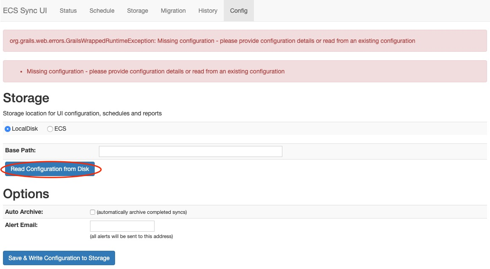

# docker-ecs-sync
## What's this?
Docker build for ecs-sync

### What is ecs-sync?
ecs-sync is a tool designed to migrate large amounts of data in parallel. This data can originate from many different sources.

### Why use ecs-sync?
There are many reasons why you may need to migrate data. Tech refreshes, switching vendors, evacuating EOL racks. Maybe your application team is starting to embrace the object paradigm and wants existing files to become objects. Or perhaps you need to move sensitive data out of a public cloud. No matter the reason, ecs-sync can probably help. It was written specifically to move large amounts of data across the network while maintaining app association and metadata. With ecs-sync, you can pull blobs out of a database and move them into an S3 bucket. You can migrate clips from Centera to ECS. You can even zip up an Atmos namespace folder into a local archive. There are many use-cases it supports.

### What it does
Using a set of plug-ins that can speak native protocols (file, S3, Atmos and CAS), ecs-sync queries the source system for objects using CLI-, XML- or IU-configured parameters. It then streams these objects and their metadata in parallel across the network, transforming/logging them through filters, and writes them to the target system, updating app/DB references on success. There are many configuration parameters that affect how it searches for objects and logs/transforms/updates references. See the [Full CLI Syntax](https://github.com/EMCECS/ecs-sync/wiki/CLI-Syntax) for more details on what options are available.

### Inspiration
Inspired by the offical ecs-sync [OVA Install Process](https://github.com/EMCECS/ecs-sync/tree/master/script/ova). As this is Dockerized, it's fair bit more portable/easy to setup and run.

# How to get started
## Git clone to a desired host.

```bash
git clone https://github.com/scr512/docker-ecs-sync.git
```

## Build the Docker image

```bash
docker build -t scr512/ecs-sync .
```

## Run

Using docker-compose is recommended as the bring up process after building ecs-sync is trivial:

```bash
docker-compose up -d
```

You can also start by using the normal `docker run` command. You'll first need to start a MariaDB/MySQL container first and then link with ecs-sync:

(Below, I'm starting MariaDB and having the database file persisted on the Docker host on /work/ecs-sync-mariadb)

```bash
docker run -d -e MYSQL_ROOT_PASSWORD=ecssyncroot -e MYSQL_DATABASE=ecs_sync --name ecs-sync-mariadb -v /work/ecs-sync-mariadb:/var/lib/mysql mariadb:latest
docker run -d -p 80:80 -p 8080:8080 -p 9200:9200 --link ecs-sync-mariadb:mysql --name ecs-sync jasdav02/ecs-sync
```

# Notes!
* Ports 80,8080 and 9200 are required for this to work seemlessly, if you do PAT you'll encounter some fun 503 errors though they are not fatal.
* When initially logging in, you'll need to click on "Read Configuration from Disk".

